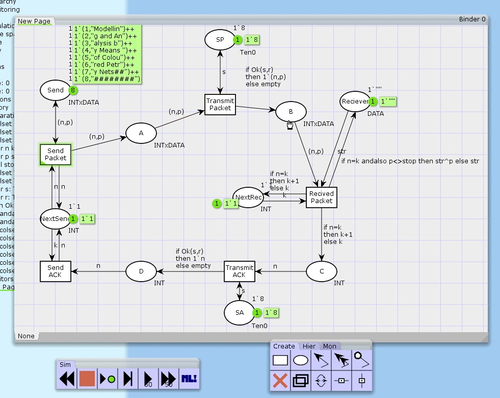
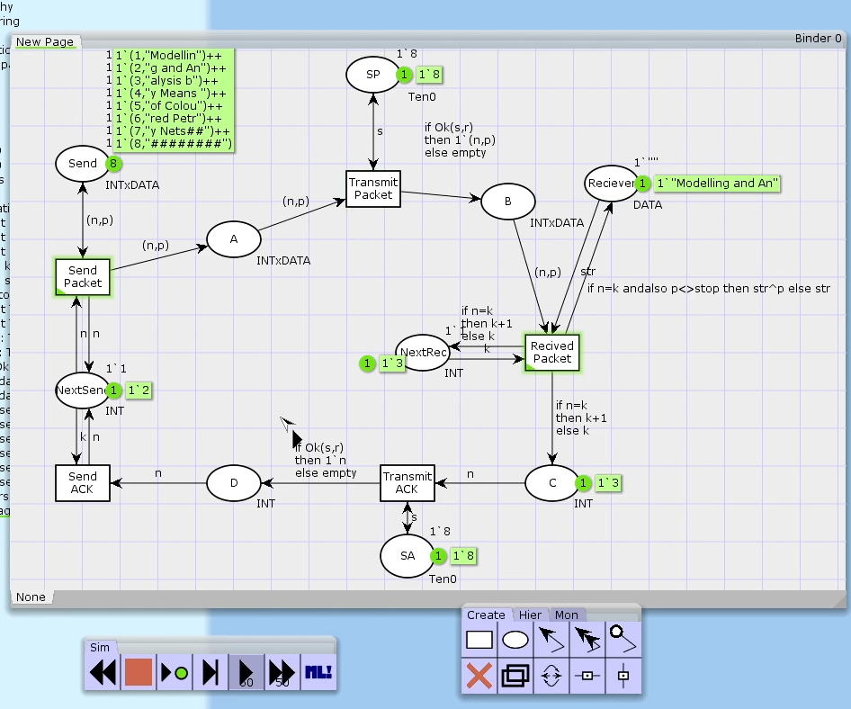
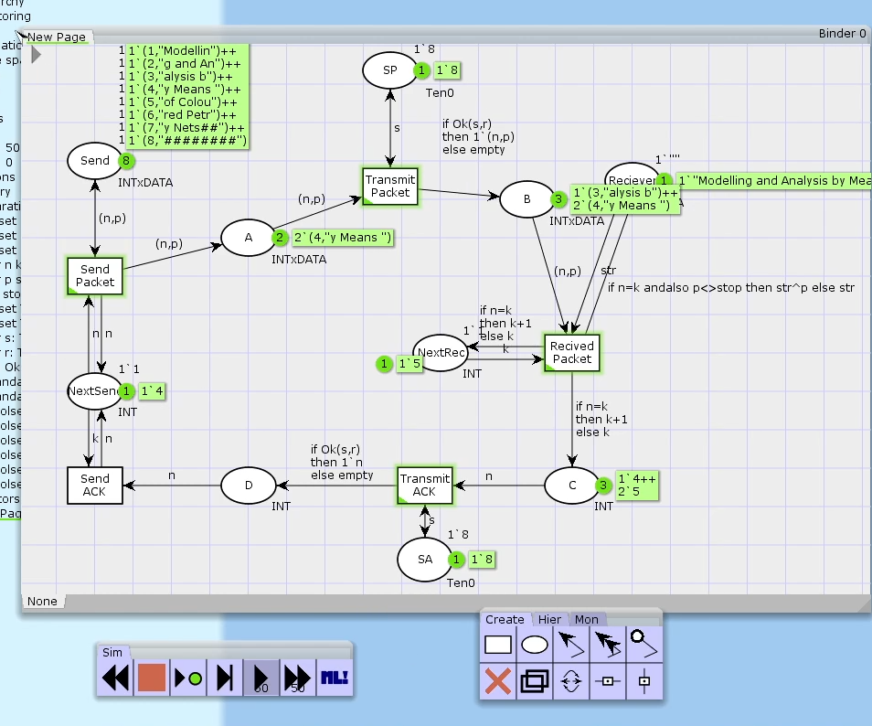
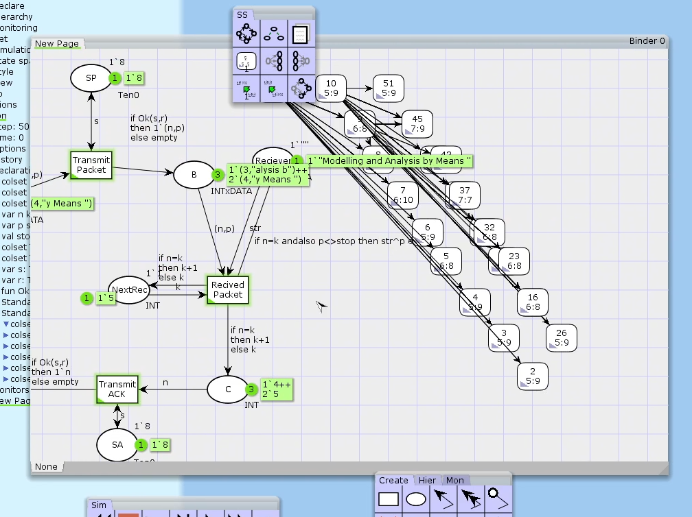

---
## Front matter
lang: ru-RU
title: Лабораторная работа №12
author: |
	 Аминов Зулфикор

institute: |
	Моделирование информационных процессов

date: 17 июня, 2022, Москва, Россия

## Formatting
mainfont: PT Serif
romanfont: PT Serif
sansfont: PT Sans
monofont: PT Mono
toc: false
slide_level: 2
theme: metropolis
header-includes: 
 - \metroset{progressbar=frametitle,sectionpage=progressbar,numbering=fraction}
 - '\makeatletter'
 - '\beamer@ignorenonframefalse'
 - '\makeatother'
aspectratio: 43
section-titles: true

---

# Цели и задачи работы

## Цель лабораторной работы

Необходимо реализовать модель простого протокола передачи данных.

## Задание

Рассмотрим ненадёжную сеть передачи данных, состоящую из источника, получателя. Перед отправкой очередной порции данных источник должен получить от получателя подтверждение о доставке предыдущей порции данных.
Считаем, что пакет состоит из номера пакета и строковых данных. Передавать будем сообщение «Modelling and Analysis by Means of Coloured Petry Nets», разбитое по 8 символов. 

# Процесс выполнения лабораторной работы

## Построенная модель

{ #fig:001 width=70% height=70% }

## Запуск модели

{ #fig:002 width=70% height=70% }

## Запуск модели

{ #fig:003 width=70% height=70% }

## Пространство состояний

{ #fig:004 width=70% height=70% }

# Выводы по проделанной работе

## Вывод

Реализовали модель простого протокола передачи данных.